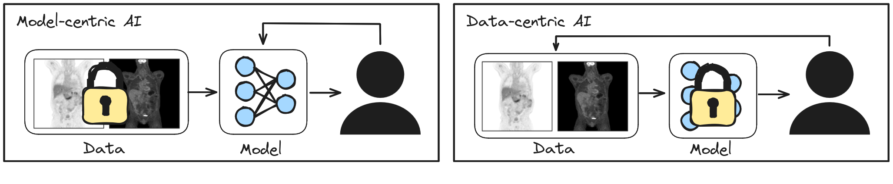
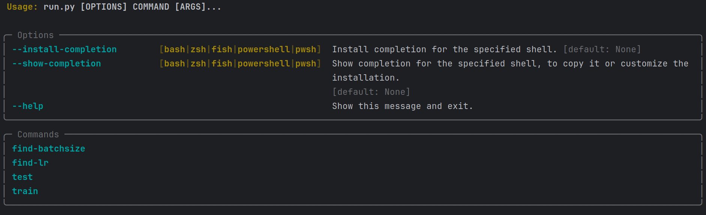

# Introduction

Welcome to the Data-Centric Baseline Model repository for the autoPET III Challenge 2024! This repository provides all the necessary resources for participating in Award Category 2, which emphasizes leveraging data handling to enhance model performance. 

Data-Centric Artificial Intelligence (DCAI) is an emerging field which finds its roots in the observation that messy real world data often limits the performance of modern models. In these cases, data cleaning, outlier removal, and judicious augmentation strategies can yield much higher performance boosts than optimizing model configurations. For those interested in learning more about DCAI, we recommend exploring the [MIT lecture Introduction to Data-Centric AI](https://dcai.csail.mit.edu/). It's important to acknowledge that the autoPET dataset isn't flawless; its complexities and reliance on medical expert labeling introduce ambiguity. Thus, the challenge lies in identifying data-related issues and address them to develop better pipelines. 

Running a data-centric challenge is difficult since it is easy to cheat and difficult to provide reference code which will work across various infrastructures. Therefore, we place great emphasis on participants' honesty and commitment to prioritizing data related methods rather than modeling advancements. If you encounter any code errors or have trouble running the code, please raise an issue to this repository rather than attempting to fix it yourself. We'll promptly address the problem and communicate updates to all participants. Thank you for your participation, and best of luck in the challenge!



## Quick setup

- Make sure you have a valid >=python3.8 installation.
- Download the repository i.e. `git clone`.
- Create a virtualenv via venv or virtualenv e.g.`virtualenv venv`.
- Activate the venv via `source venv/bin/activate`
- Install the package via `pip install -e .`
- Download the [dataset](https://it-portal.med.uni-muenchen.de/autopet/Autopet.tgz) and unzip it to a location of your choice
- To validate the setup, please download the test folder via `git lfs pull` and then run `python run.py train --config=config/test_config.yml`

## How it works

For the datacentric award category we provide this reference package called autopet3. As described [here](https://autopet-iii.grand-challenge.org/task/) in more detail, The task is to develop preprocessing scripts (e.g. remove outlier, correct labels), datapipelines (e.g. augmentations, normalizations, sampling methods) or postprocessing to improve model performance beyond the given baseline. The package contains a fixed model (which may not be changed) and a training pipeline to give participants a starting point and more time to focus on the data. 

The package is divided into two subpackages: `datacentric` and `fixed`. While the fixed package may not be altered (we will check for that, but if there is a problem with the code please create an issue on github), the datacentric subpackage is the place where you should implement your datacentric ideas. Further, you are free to build any dataconversion scripts to alter the dataset before training. We also provide functionality for training and testing the model and finding a good learning rate or batchsize. The code is build on MONAI and pytorch lightning and resembles a basic 3D nnUNet configuration (with some minor differences). We encourage you to use the Lightning infrastructure, namely the Trainer class for training the model.

### The fixed model

For the second award category we provide a fixed model. Our model is a replication of the nnUNet  architecture. We utilized the nnUNet fingerprint extractor and planner on the autoPET3 dataset to configure the model. The resulting model configuration looks as follows:

```
roi      = (128, 160, 112)
spacing  = (2.03642011, 2.03642011, 3.)
kernels  = [[3, 3, 3], [3, 3, 3], [3, 3, 3], [3, 3, 3], [3, 3, 3], [3, 3, 3]]
strides  = [[1, 1, 1], [2, 2, 2], [2, 2, 2], [2, 2, 2], [2, 2, 2], [1, 2, 1]]
```

The model code is available in [autopet3/fixed/dynunet.py](autopet3/fixed/dynunet.py). This code is fixed and should not be altered. It contains a [lightning module](https://lightning.ai/docs/pytorch/stable/common/lightning_module.html), which configures the basic model architecture, the optimizer, the learning rate scheduler and the sliding window function. Using the config, you have access to the learning rate and the sliding window batch size. The learning rate scheduler is automatically calculated based on the number of epochs. Please note that on a single GPU with a batch size of 2, approximately 8500MB of VRAM is required.

### Training

We provide a simple training routine to get you started right away. The routine has three basic interfaces you can interact with: A lightning datamodule to set up the datapipeline, a config file to set parameters and a commandline interface (cli) to start train and test routines.

#### The cli




#### The config

We use a YAML file to control all configuration parameter for the model, the datamodule and the training and testing procedure. A default config is provided in [config/test_config.yml](config/test_config.yml). The three main sections are `data`, `model`, and `trainer`:

- `data`: All arguments you want to pass to the DataModule ie. data_dir, num_worker (cf. [autopet3/datacentric/dataloader.py](autopet3/datacentric/dataloader.py))
- `model`: Model arguments (lr, sw_batch_size, pretrained, resume and ckpt_path)
- `trainer`: Supports all trainer args, except for callbacks and logger which belong to the fixed code

#### The datamodule

The datamodule in `autopet3/datacentric/dataloader.py` describes your datapipeline and can be freely edited by you. It's a basic [lightning datamodule](https://lightning.ai/docs/pytorch/stable/data/datamodule.html) where you should implement your own versions of the functions setup, train_dataloader and val_dataloader. The current file implements our baseline approach (see the baseline implementation).

#### Training routine hooks

##### Setup

If you compute your experiment on a cluster infrastructure you sometimes need to set up environment variables. You can do this by changing the setup hook in [autopet3/datacentric/setup.py](autopet3/datacentric/setup.py). In this examplary implemention, I needed to set the environment variable `SLURM_JOB_NAME` to "bash", to be able to run the code on a slurm cluster routine from a jupyter-notebook. Adapt this function to your own needs.

```python
def setup() -> None:
    os.environ["SLURM_JOB_NAME"] = "bash"
```

##### Logger

The baseline project uses the default logger of pytorch lightning. This logger writes tensorboard event files to the `lightning_logs/` directory. To investigate your runs, simply run `tensorboard --logdir lightning_logs`(tensorboard needs to be installed). The logger is accessed in the train script by importing `from autopet3.datacentric.logger import get_logger`. You can easily switch the default logger with a [logger](https://lightning.ai/docs/pytorch/stable/api_references.html#loggers) of your choice by changing the `get_logger()` function. The `get_logger` function receives the loaded config yaml as accessible OmegaConfig and has to return a lightning logger to be compatible with the main code.

```python
def get_logger(config: Union[DictConfig, ListConfig]) -> Logger:
    print(f"Started experiment {config.logger.experiment} using a tensorboard logger")
    logger = TensorBoardLogger("lightning_logs/", name=config.logger.experiment)
    return logger
```

## Example implementation - Datacentric baseline

We want participants to focus on the data. Therefore, we anticipated data-centric modification at three points in the training workflow and give in the following examples for each of them.

#### Adding a datamodule

This example datamodule customizes the dataloading. It uses a MONAI pipeline which is inspired by the nnUnet dataloading:

```python
from autopet3.datacentric.transforms import get_transforms
...

class AutoPETDataModule(pl.LightningDataModule):
    def __init__(self, data_dir: str = "path/to/dir", batch_size: int = 1, target_shape: tuple = None, suffix=".nii.gz",
                 splits_file: str = None, fold: int = 0, num_workers_train: int = 2, num_workers_val: int = 2):
        super().__init__()
        self. kwargs = ...

    def setup(self, stage: str):
        # We use kfolding and extract a split for train and val
        split = read_split(self.splits_file, self.fold)

        # We construct a file dict containing the nifti files
        train = get_file_dict_nn(self.data_dir, split["train"], suffix=self.suffix)
        val = get_file_dict_nn(self.data_dir, split["val"], suffix=self.suffix)

        # Then we use the Monai dictionary dataset with a custom transform pipeline, which is similar to the nnUNet pipe
        self.train_dataset = Dataset(train, transform=get_transforms("train", self.target_shape, resample=resample))
        self.val_dataset = Dataset(val, transform=get_transforms("val_sampled", self.target_shape, resample=resample))
        self.test_dataset = Dataset(val, transform=get_transforms("val", self.target_shape, resample=resample))

    def train_dataloader(self):
        return DataLoader(self.train_dataset, batch_size=self.batch_size, num_workers=self.num_workers_train)

    def val_dataloader(self):
        return DataLoader(self.val_dataset, batch_size=self.batch_size, num_workers=self.num_workers_val)

    def test_dataloader(self):
        return DataLoader(self.test_dataset, batch_size=1, num_workers=self.num_workers_val)
```

You can find the `get_transforms` function in [autopet3/datacentric/transforms.py](autopet3/datacentric/transforms.py). The function generates a series of transforms based on the stage and target shape. It performs loading, resampling, shifting intensity ranges, and applying various augmentation techniques such as affine transforms, noise, blur, intensity adjustments, flips, and more. It also performs normalization and concatenates the transformed data into a single tensor.

#### Adding a preprocessing script

A preprocessing script can be used to clean the dataset, remove outlier or generally alter the dataset. An illustrative example of such a script can be found in [scripts/preprocess_augmentations.py](scripts/preprocess_augmentations.py). Due to the time-consuming nature of preprocessing and loading large datasets, we precalculate transformations and sampling. This approach speeds up the training time by a large amount. The provided script serves as an exemplary demonstration of how to implement preprocessing tasks.

#### Adding a postprocessing method

The predict function [predict.py](predict.py) integrates a postprocessing function. Test-time augmentation (TTA) was used to improve model performance. In addition, fewer random rotations were used to obtain a faster prediction time. We allow for ensembling even it's not strictly datacentric, but it can be considered best practice in a challenge setup. 
There are a lot of post calibration techniques, etc, which we did not explicitly forbid. If any of these methods contribute more to the performance than your data methods please be fair and submit your method to award category 1 only.


